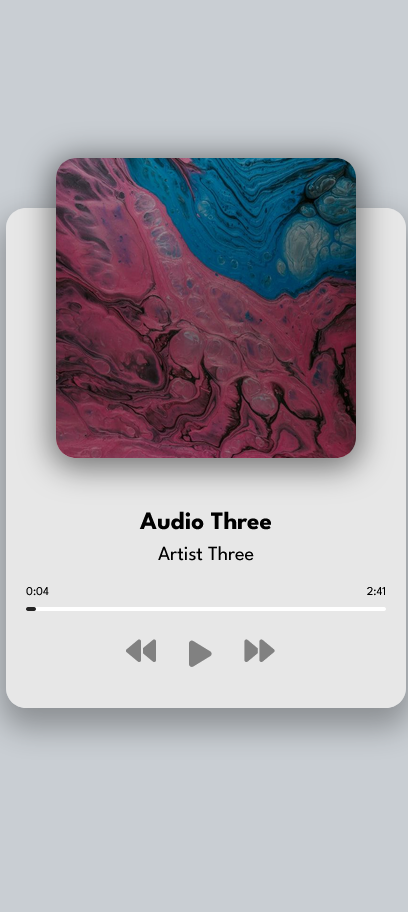
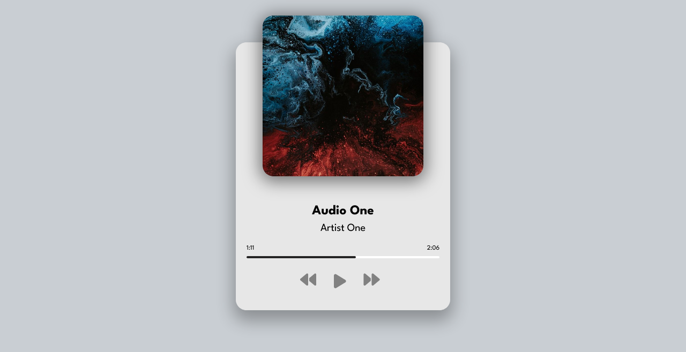

# Audio Player

This is a small project to build a simple page that have a custom audio player.

## Table of contents

- [Overview](#overview)
  - [The project](#the-project)
  - [Screenshot](#screenshot)
  - [Links](#links)
- [My process](#my-process)
  - [Built with](#built-with)
  - [What I learned](#what-i-learned)
  - [Useful resources](#useful-resources)
- [Author](#author)

## Overview

### The project

Audio player features:

- Show audio detail such as image, title, and artist(s)
- Play/stop audio
- Next/Previous audio with loop when user has reached its limit when clicking next or previous button
- Fast forward or backward audio by clicking progress bar
- Update the UI when audio track is changed

### Screenshot

##### Light Mode

#### Desktop preview

### Links

- [Github repo](https://github.com/nurmarief/audio-player/)
- [Live site](https://nurmarief.github.io/audio-player/)

## My process

### Built with

- Semantic HTML5 markup
- BEM architecture for CSS
- Mobile-first workflow

### What I Learned

In this project I learned about audio tag methods, properties, and events.

### Useful resources

- [fontawesome](https://www.fontawesome.com/)
- [google fonts](https://www.fonts.google.com/)

## Author

- [nurmarief](https://github.com/nurmarief)
